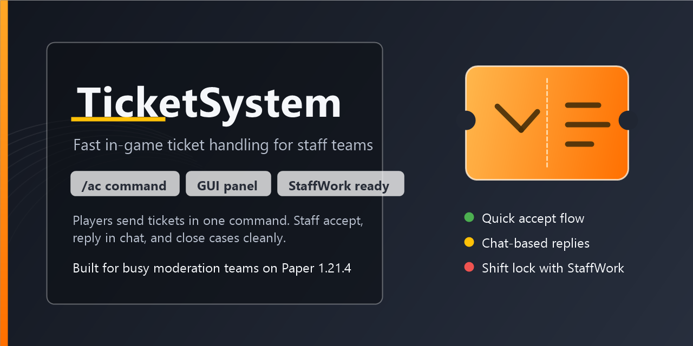
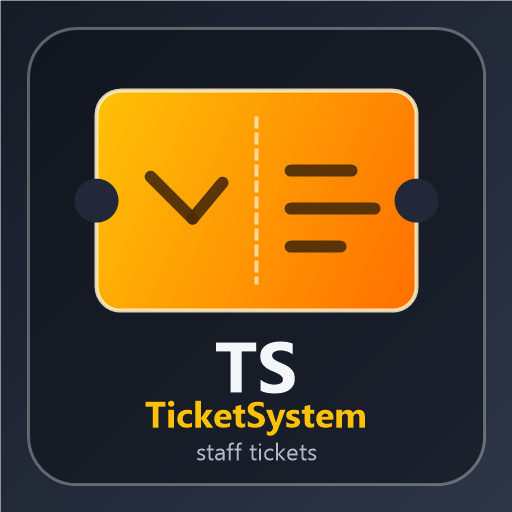

# TicketSystem



Lightweight in-game ticket handling for Minecraft servers.

`TicketSystem` lets players contact staff with a single command and gives moderators a fast workflow to accept tickets, reply through chat, and close them automatically.

## Preview

<p align="center">
  
</p>

## Features

- Create player tickets with `/ac <message>`
- Notify online staff instantly when a new ticket is created
- Accept tickets directly from chat
- Manage open tickets in a GUI panel with `/tickets`
- Reply to the player through normal chat
- Close the ticket automatically after the reply
- Remind staff about unanswered tickets
- Auto-release tickets if they stay in progress too long
- Limit players to one active ticket at a time
- Optional `StaffWork` integration for shift-based ticket handling

## Compatibility

- Minecraft `1.16.5` to `1.21.11`
- Spigot / Paper servers
- Java `11+`

## Commands

- `/ac <message>` - create a ticket
- `/tickets` - open the ticket panel
- `/tickets accept <player-uuid>` - accept a ticket manually

## Permission

- `ticketsystem.admin` - access to ticket panel and ticket handling

## How It Works

1. A player writes `/ac <message>`.
2. Online staff receive a notification.
3. A staff member accepts the ticket from chat or from the GUI panel.
4. The staff member writes a normal chat message.
5. The player receives the answer.
6. The ticket closes automatically.

## StaffWork Integration

If [`StaffWork`](https://github.com/blackcago1377) is present on the server, `TicketSystem` can check whether a staff member is currently on shift.

In this mode:

- staff still receive notifications about new tickets
- ticket answering can be restricted to active shifts

If `StaffWork` is not installed, `TicketSystem` works as a standalone plugin.

## Configuration

Main config:

- [`src/main/resources/config.yml`](src/main/resources/config.yml)

You can configure:

- admin permission node
- reminder interval
- auto-release time
- GUI text
- ticket messages
- optional shift-required messages

## Build

Requirements:

- Java `11` or newer
- Maven

Build:

```bash
mvn clean package
```

Output:

- `target/TicketSystem-1.0.0.jar`

## Source Structure

- [`src/main/java/me/kawasaki/tickets/TicketSystemPlugin.java`](src/main/java/me/kawasaki/tickets/TicketSystemPlugin.java) - main plugin logic, commands, GUI, reminders, ticket handling
- [`src/main/java/me/kawasaki/tickets/models/Ticket.java`](src/main/java/me/kawasaki/tickets/models/Ticket.java) - ticket data model
- [`src/main/resources/plugin.yml`](src/main/resources/plugin.yml) - plugin metadata
- [`src/main/resources/config.yml`](src/main/resources/config.yml) - plugin configuration

## Installation

1. Build the project with Maven or use the compiled jar.
2. Put `TicketSystem-1.0.0.jar` into your server `plugins` folder.
3. Start the server.
4. Edit the generated config if needed.
5. Restart or reload the plugin properly through a full server restart.

## Notes

- Ticket data is stored in the plugin config.
- The plugin is intentionally simple and focused on fast moderation workflow.
- Console is treated as admin where applicable.
